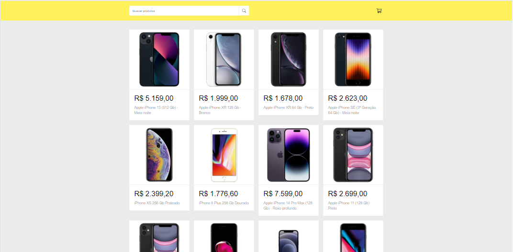
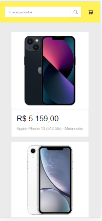

# Shopping cart with React Js



## About the project

This is a shopping cart project developed with React Js. It allows you to list products on the screen, search for products consuming the Mercado Livre API, add products and remove products from the cart.

## Table of contents

- [Overview](#overview)
  - [Functionalities](#functionalities)
- [Screenshot](#screenshot)
  - [Links](#links)
- [My process](#my-process)
  - [Built with](#built-with)
- [Installation](#installation)
  - [Frontend](#frontend)
- [Author](#author)
- [License](#license)


## Overview

### Functionalities

- Product listing
- Product search
- Adding products to the cart
- Removing products from the cart

## Screenshot

### Layout mobile



 
### Layout web


### Links

- Vercel: [URL project](https://shopping-cart-api-react.vercel.app/)

## My process

### Built with

- Semantic HTML5 markup
- CSS custom properties
- Flexbox
- Mobile-first workflow
- [React](https://reactjs.org/) - JS library
- [Styled Components](https://styled-components.com/) - For styles

## Installation

### Frontend

1. Clone this repo
```bash
git clone https://github.com/daianaadepaula/shopping-cart-api-react.git
```

2. Go to the project folder
```bash
cd shop-cart-api-react
```

3. Install dependencies
```bash
npm install
```

3. Run Frontend
```bash
npm start
```

## Author

We thank the following people who contributed to this project:

<table>
  <tr>
    <td align="center">
      <a href="#">
        <br>
        <sub>
          <b>Daiana de Paula</b>
        </sub>
      </a>
    </td>
    
</table>

## License

[](https://github.com/daianaadepaula/shopping-cart-api-react/blob/master/LICENSE) 

